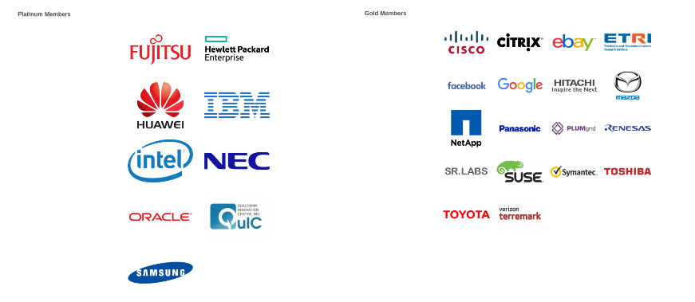
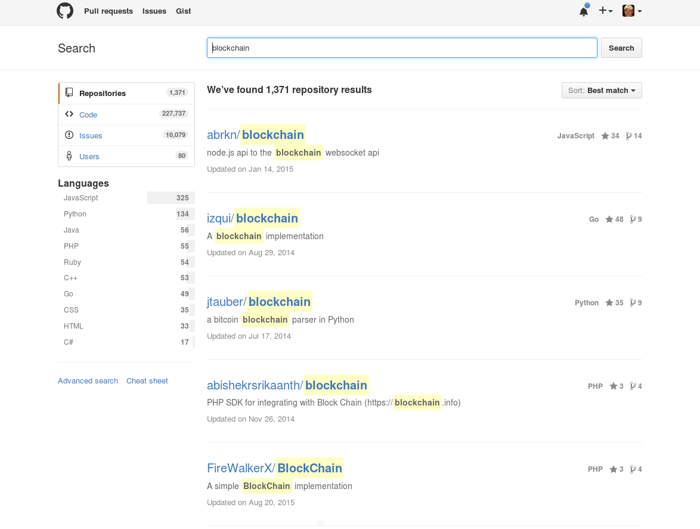
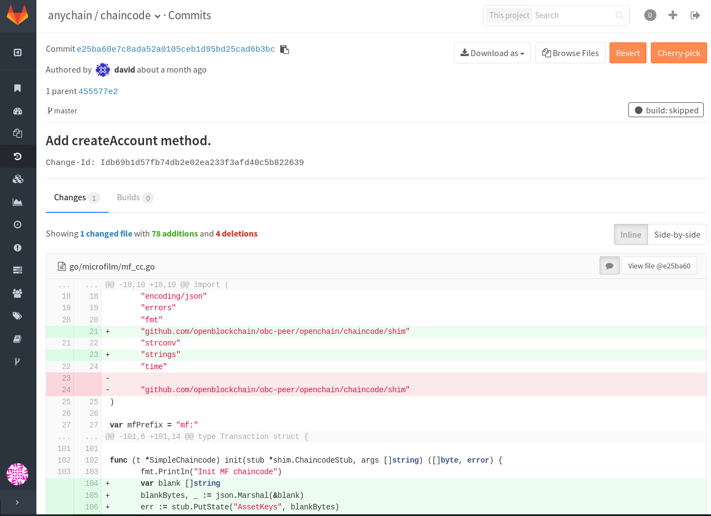
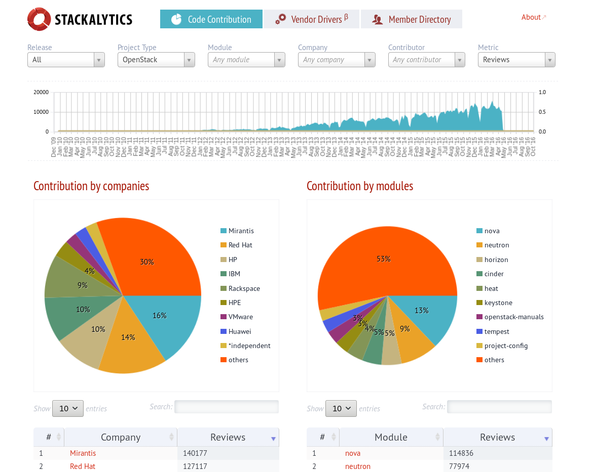

# OpenSource and DevOps

Disclaimer: the content in this document was collected from my personal idea and information from open source community, specially Hyperledger at Github.com and Linux Foundations.

# 目录    
<!-- TOC depthFrom:1 depthTo:6 withLinks:1 updateOnSave:1 orderedList:0 -->

- [OpenSource and DevOps](#opensource-and-devops)
- [目录](#目录)
	- [0. 文档目标](#0-文档目标)
	- [1. 哲学](#1-哲学)
	- [2. 让世界都成为你的团队（汇集世界的力量）](#2-让世界都成为你的团队汇集世界的力量)
	- [3. 软件设计的艺术（API经济）](#3-软件设计的艺术api经济)

<!-- /TOC -->

## 0. 文档目标
I just want to describe my thoughts of how a spirit is driving me to believe in #OpenSource

## 1. 哲学
## 2. 让世界都成为你的团队（汇集世界的力量）
* Linux – 开源软件和创新的根基
* HyperLedger项目所在的Linux Foundation - 全球180+企业加入

## 3. 软件设计的艺术（API经济）
* Github.com – 用于代码版本控制(version control)，并且多团队的合作开发平台。仅仅区块链就有1300+个项目(截至2016年5月)

* Slack.com – 团队协作沟通平台(channel, direct message, file upload/ share, notif, and integration)

* Gerrit和Stackalytics.com

* StackOverflow.com –
