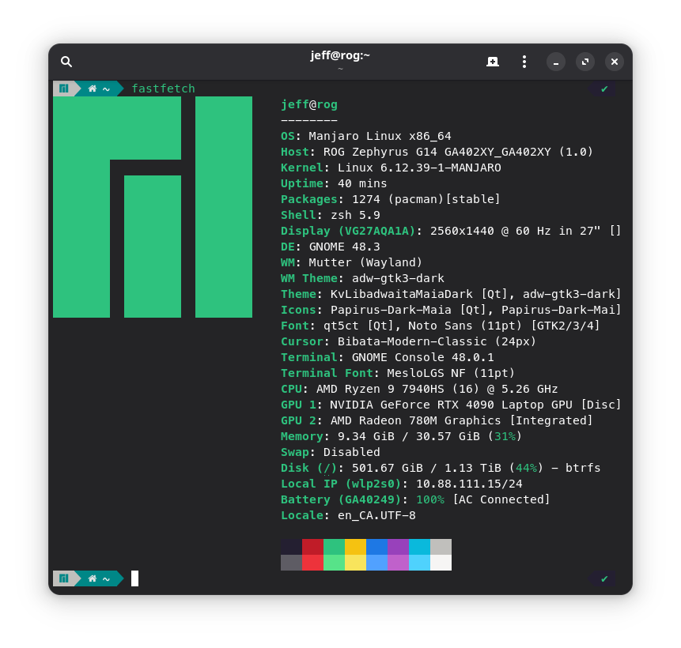
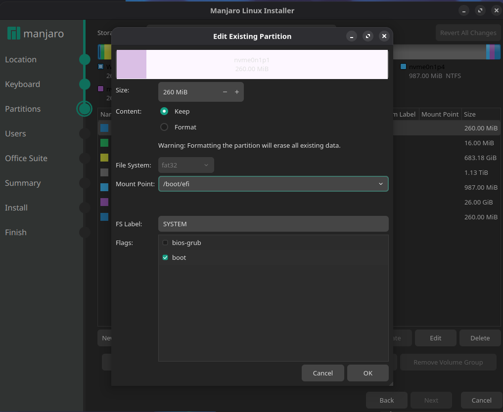
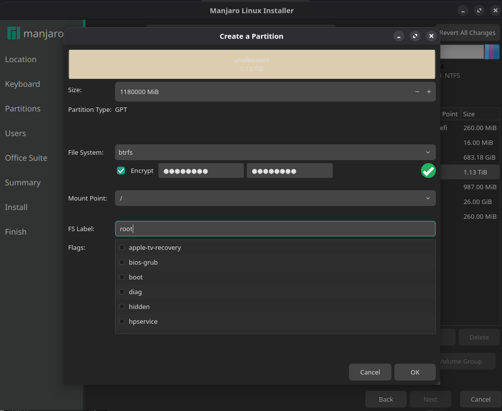

# Installing Manjaro Linux on the ASUS ROG Zephyrus G14 (2023) with NVIDIA 4090 - My Experience


## Objective
- Install Manjaro Linux alongside Windows 11 on my ROG Zephyrus G14 (2023, NVIDIA 4090, 32GB RAM).
- Encrypt the Linux root partition for security.
- Retain Windows (factory restore) for gaming, after upgrading to a 2TB SSD.

## Why Manjaro?
- As a long-time Debian user, I appreciate its minimalism and flexibility. However, I struggled to get the NVIDIA drivers fully functional on Debian with this GPU, facing display issues after boot. I'm too lazy.
- Manjaro stood out by offering proprietary NVIDIA drivers out-of-the-box, providing a simpler, smoother setup.



## Preparation - Windows Setup & Disk Partitioning
1. (optional) Follow the official ASUS instructions for restoring Windows after your SSD upgrade.

2. Use Windows Disk Management to shrink the Windows partition. I allocated about 700GB for Windows and left 1.2TB for Manjaro.

3. I won't cover the Windows reinstallation here - just proceed as ASUS recommends.

4. One important thing to remember is that you need to disable Secure Boot in the BIOS before starting the Linux installation, and you can re-enable it afterward if desired.

## Creating the Installation USB
1. Download the Manjaro ISO from the official website.
2. Burn the ISO to USB from any Linux device with this command:

    ```
    dd if=/path/to/manjaro.iso of=/dev/sdX bs=8M status=progress && sync
    ```
3. Replace /dev/sdX with your USB's device name (check using `lsblk` to avoid overwriting your drives).


## Installation Notes

#### Boot into Manjaro Installer

- Plug in the USB, reboot, and select it in your BIOS/boot menu.
- Select **Boot with proprietary drivers**. Choosing proprietary makes setup much easier.

#### Partitioning ("Manual" Method)
- Choose Manual Partitioning.
- Mount the EFI partition (usually ~260MB, created by Windows) at `/boot/efi`. Do not format this partition - formatting wipes Windows boot info and can break the bootloader (GRUB).



- You might see a warning about the EFI partition being under 300MB. This is common on OEM machines; you can safely ignore it.

- Create a new partition for Linux root `/`. I dedicated all unallocated space to root and checked the "Encrypt" option for security. Note: booting time will take longer up to 40 seconds when selecting "Encryption" option.



#### File System Choice
- I typically use **xfs** on encrypted systems, but let Manjaro default to **btrfs** this time. Both work well - choose what suits your needs, or research if you have specific requirements.

## Final Tips
- After installation, Manjaro should detect and configure NVIDIA drivers automatically.
- Dual-boot is seamless as long as the EFI partition remains intact.
- Enjoy your gaming and Linux dev environment - all on the same premium hardware!