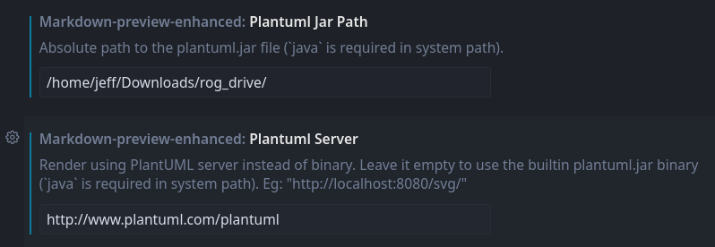

# Enable Beautiful PlantUML on Linux

## Objective


## What is PlantUML

## Why PlantUML
- It's beautiful for architecture diagram and mindmap
- Simple and everything is code in plain text
- Compatible with Cursor editor and VScode


## Pre-requisite

I demonstrate this tutorial on Manjaro Linux particularly. However it's compatible to all other distrubtions of Linux

#### Java and Graphviz

On Manjaro, install `jdk11-openjdk` and `graphviz`. The package name _might_ be a little bit different for other Linux distro

```sh
pacman -S jdk11-openjdk graphviz
```

After Java gets installed, you'd need to add its path globally to allow IDE find it. On Manjaro, add the following in bottom of `~/.zshrc` (or `~/.bashrc`, depending on which shell you prefer). 


```sh
export PATH=$PATH:/usr/lib/jvm/java-11-openjdk/bin
```

Then source to make it take effective

```sh
source ~/.zshrc
```


#### IDE with an extenstion, called `markdown-preview-enhanced`

For both VScode and Cursor editor

#### Download `plantuml.jar`

You can find such jar file at https://plantuml.com/download and download it. Write down its specific path. In my case, it's stored at `~/Downloads/rog_drive/plantuml.jar`

#### Configuration

I'm giving an example of extension configuration for Cursor and it'd be exactly the same on VScode

- File > Preferences > Extensions > click the setting of "Markdown Preview Enhanced" (a gear-wheel icon right-below) > select "Settings". Scroll down almost the bottom in this page then you'd manually input as the following


#### Security Tip

Check here >  https://plantuml.com/security

Your plantUML code will be sent to PlantUML public server over internet, then the diagram will be render over there. If your data is sensitive and you don't want to expose it on internet. You'd need to setup your private PlantUML server for rendering

To setup a private server, visit here >  https://plantuml.com/security.